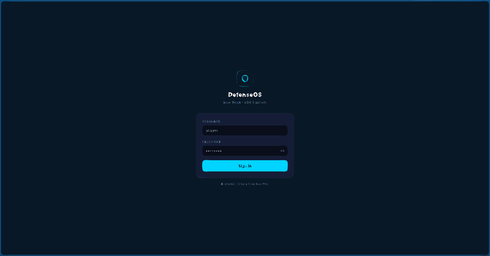
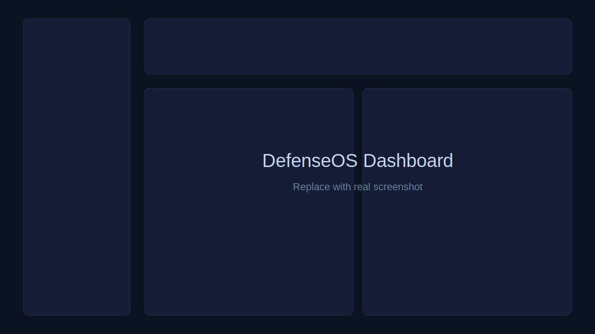
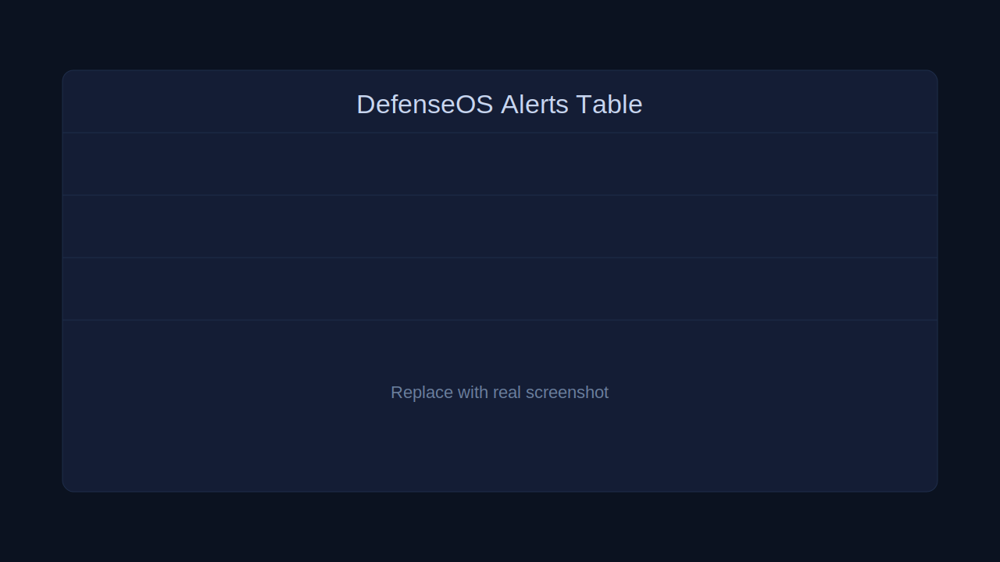
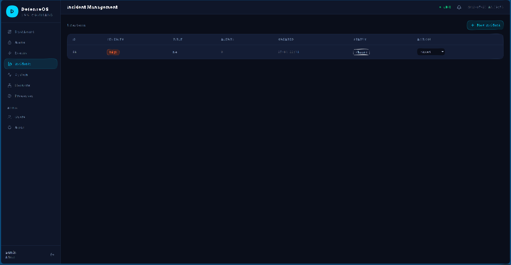

# DefenseOS

[English](README.md) | [Espanol](README.es.md)

<!-- Reemplaza OWNER/REPO por tu usuario y repo en GitHub -->
[](https://github.com/OWNER/REPO/actions/workflows/backend-ci.yml)
[](https://github.com/OWNER/REPO/actions/workflows/frontend-ci.yml)

Laboratorio end-to-end de SOC y Blue Team para seguridad defensiva aplicada.

DefenseOS ingiere señales del host, las normaliza como eventos de seguridad, correlaciona eventos en alertas y gestiona incidentes desde una sola consola web.

## Resumen

Este proyecto demuestra flujo operativo completo, no scripts aislados:

1. Recolectar telemetria y logs del host
2. Clasificar y persistir eventos de seguridad
3. Correlacionar eventos en alertas accionables
4. Gestionar el ciclo de vida de incidentes
5. Operar desde un dashboard SOC en vivo

## Valor para demo en 60 segundos

1. Login como admin/analista
2. Ver metricas del sistema en tiempo real
3. Revisar feed de eventos con filtros
4. Triage de alertas por estado
5. Crear y actualizar incidentes

Guia completa: [docs/DEMO_RUNBOOK.md](docs/DEMO_RUNBOOK.md)

## Capturas

> Reemplaza los placeholders en `docs/media` por capturas reales de tu app.

Login



Dashboard



Alertas



Incidentes



## Stack tecnologico

### Backend

- Python 3.13
- FastAPI
- SQLAlchemy 2.x async
- Pydantic v2
- Structlog
- Psutil
- Pytest + pytest-asyncio

### Frontend

- React 18
- Vite
- Tailwind CSS
- React Query
- Axios
- Recharts

## Inicio rapido

### Opcion A: scripts locales (recomendado)

```bash
cd /home/safe/pentest/tools/def
bash scripts/setup.sh
bash scripts/start-dev.sh
```

- Frontend: http://localhost:5173
- API docs: http://localhost:8000/api/docs

Usuario bootstrap por defecto:

- Username: admin
- Password: Admin1234!

### Opcion B: Docker

```bash
cd /home/safe/pentest/tools/def
docker-compose up --build
```

- Frontend: http://localhost:80
- API docs: http://localhost:8000/api/docs

## Testing

```bash
cd backend
.venv/bin/python -m pytest tests -v
```

## Documentacion

- Arquitectura: [docs/ARCHITECTURE.md](docs/ARCHITECTURE.md)
- Runbook demo: [docs/DEMO_RUNBOOK.md](docs/DEMO_RUNBOOK.md)
- Roadmap: [ROADMAP.md](ROADMAP.md)
- Contribucion: [CONTRIBUTING.md](CONTRIBUTING.md)
- Checklist de portafolio: [docs/PORTFOLIO_CHECKLIST.md](docs/PORTFOLIO_CHECKLIST.md)
- Kit de overview de GitHub: [docs/GITHUB_OVERVIEW.md](docs/GITHUB_OVERVIEW.md)

## Nota de seguridad y etica

DefenseOS es para uso educativo y defensivo en entornos autorizados.

No lo uses en produccion sin hardening, gestion de secretos, controles de autenticacion robustos y monitoreo adecuado.
